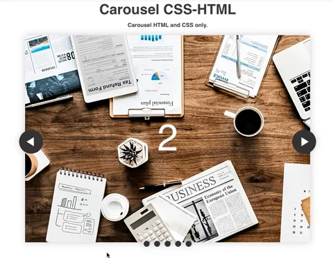

<h1 align=center> ** Carousel ** </h1>

[](https://github.com/RichardLitt/standard-readme)
[](https://david-dm.org/dwyl/esta)


- in this project i created Carousel with plain CSS and HTML. i didn't use webpacker or any bundler because it was a mini web app.  
- I basically created a list of five element with images in each of them and each of this element has an inner div with two anchor element. one of the anchor elemenet takes you to the next slide or the next element in the list while the other takes you to the previous. 
- the anchor elements in the inner divs makes use of slide ID to navigate through the list of the five elements.
- I also have an aside element that makes use of anchor tags also to jump to a particular slide. 
- for the CSS styling i used made use of keyframes to animate through the slides




## Background

- HTML 
- CSS


## Demo
 Check out the live demo of the project. [Click Here]()


## Usage

```sh
$ git clone https://github.com/macbright/carousel-css.git carousel
```
<br /> Clone the repository to your local machine


```sh
$ cd carousel
```
<br /> cd into the directory


`$ open with live server` 
<br /> right click on the index and open with live server


## Maintainers 

👤  **Bright Okike**

- Github: [@macbright](https://github.com/macbright)
- LinkedIn: [@bokike](https://www.linkedin.com/in/bokike/)
- Twitter: [@b_okike](https://twitter.com/b_okike)


## Contributing

1. Fork it (https://github.com/macbright/carousel-css.git)
2. Create your feature branch (git checkout -b feature/[choose-a-name])
3. Commit your changes (git commit -am 'What this commit will fix/add')
4. Push to the branch (git push origin feature/[chosen name])
5. Create a new Pull Request

## License

Bright okike
[MIT license](https://opensource.org/licenses/MIT).